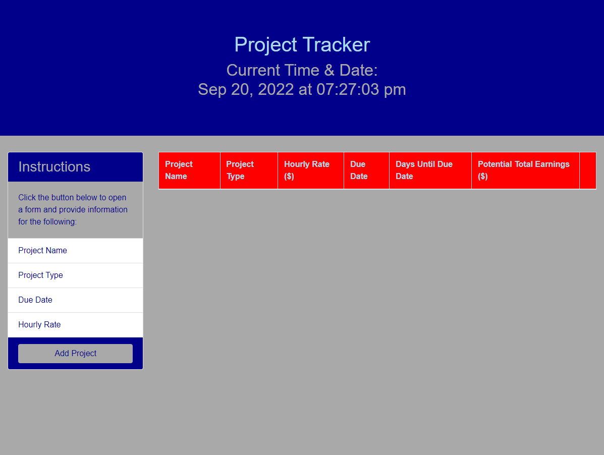

# Project-Tracker-
In this project, I am creating a project tracker application using Bootstrap, jQuery, jQueryUI, Moment, and Google Fonts.

## Description

This project is divided into four tasks. 

### Task 1: HTML Build

1. The HTML includes a header/hero area that welcomes users to the application and displays the current time and date using Moment.js with `setInterval()`.

2. The HTML includes a Bootstrap card component.

3. The HTML includes a modal that contain a form asking users to fill in the following data:

    * The name of the project

    * The type of project (use a `<select>` drop-down)

    * The hourly wage for the project

    * The due date for the project (use jQuery UI's datepicker with a minimum date setting in place)

4. The HTML also include a Bootstrap table that the project's information can be printed to with columns for the following data:

    * Project name

    * Project type

    * Hourly wage

    * Due date

    * Days until the due date (use Moment.js to calculate)

    * Estimated total earned (hourly wage at 8 hours per day multiplied by the number of days until the due date)

### Task 2: Capturing Form Data

1. Using jQuery, I set up a functionality to capture the form's input elements on submit and use that data to create a new table row on the page.

2. Selecting and saving references to every DOM element we will interact with to a variable (i.e., `var projectFormEl = $("#project-form");`) so that we can use these elements later.

3. Attached a submit event listener to the `<form>` element using jQuery.

4. On submission, captured the four input values from the form and pass them to another function to handle printing project data. Having one function that captures the data and another that prints the data to the page's `<table>` element will improve code readability.

---

### Task 3: Printing Project Data to Page

1. Created a function that will accept the four input fields' data as arguments.

2. Created a table row (`<tr>`) element and save it to a variable.

3. Create da table detail (`<td>`) element for each of the table columns created in Task 1.

4. For printing the days to the due date, use Moment.js to calculate the difference between the due date and the current time in days. 

5. For printing the estimated total earned amount, assumed that you work an eight-hour day. So we multiplied the hourly rate by 8 to get the daily rate, then multiply that value by how many days until the project is due to get the estimated total earned. 

6. Append all `<td>` elements to the table row created, then append the entire row to the `<tbody>` element on the page.

7. Don't forget to close the modal when done!

---

### Task 4: Deleting a Project From the Table

1. Updated the table to accommodate one more column without a name.

2. When generating a new `<tr>` for a project, added one more `<td>` that holds a button for deleting a project from the list.

3. Use jQuery event delegation to attach an event listener to each of those buttons so that when clicked, the parent `<tr>` element will be removed from the page.

---

### Link To Deployed Webpage 

### Screenshot
The following animation demonstrates the application functionality:

© 2022 Trilogy Education Services, LLC, a 2U, Inc. brand. Confidential and Proprietary. All Rights Reserved.